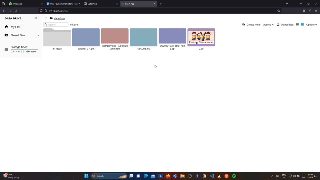
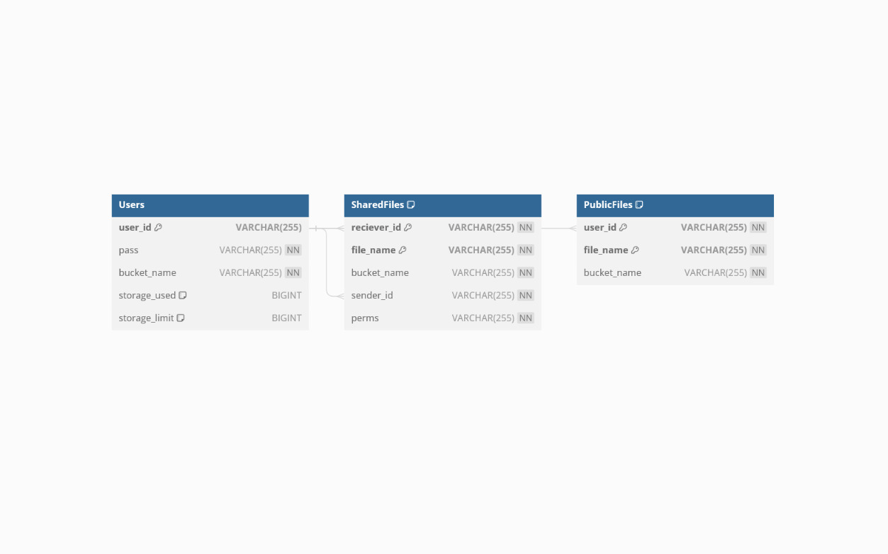
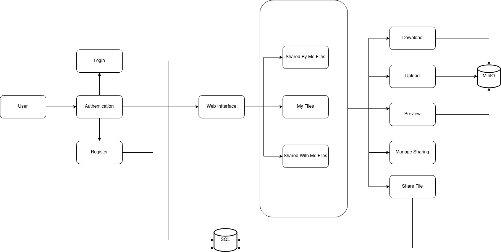
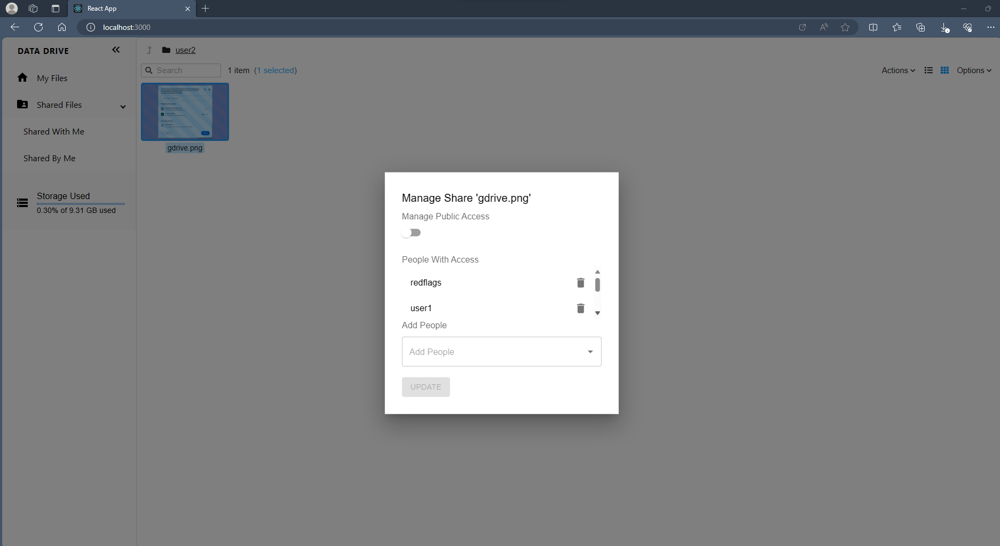
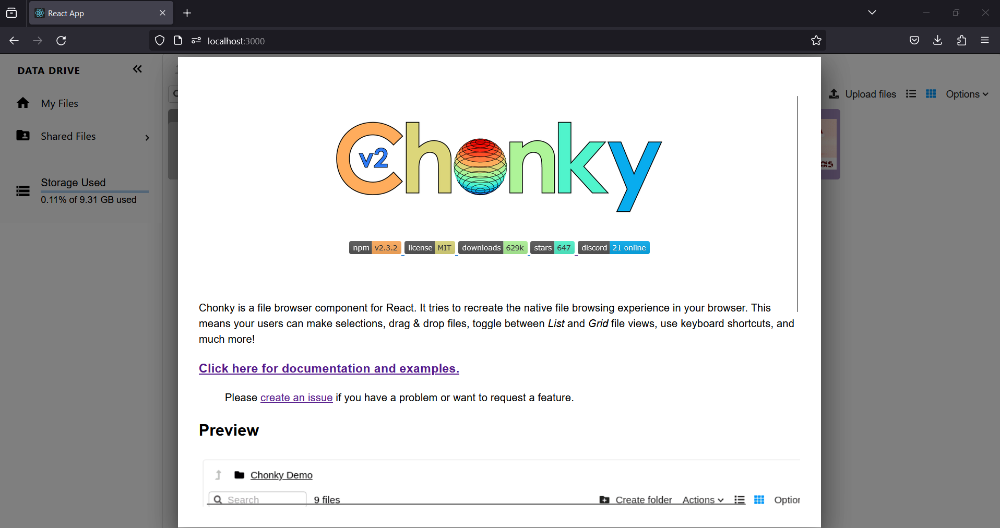
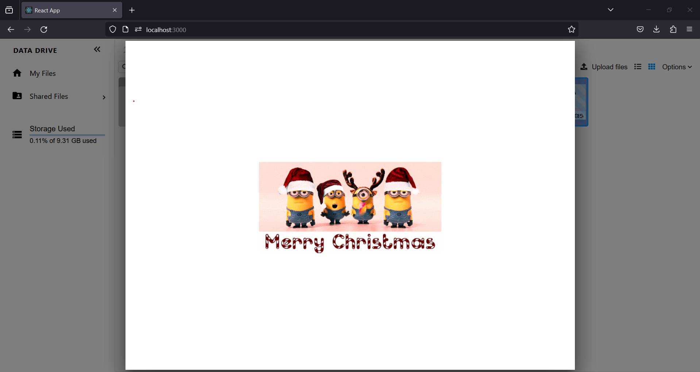

# Data-Drive_Red-flags

# Project Description

Data Drive is a flexible platform for managing data that works well with MinIO.
On top of MinIO, it provides an abstraction layer that add to it the new functionalities and a user-friendly interface. We are able to effectively manage, access, and work.

<center>

</center>

## Architecture

1. Backend: Backend is built using Flask, a python based framework.
2. Frontend: Frontend is built using ReactJS, a javascript based framework. We use the chonky file browser package for the frontend.
3. DataBases: For Database we use two databases, one is SQL which is used for storing the metadata of the files, permissions,
   users, etc. The other is MinIO which is used for storing the actual files.
4. Authentication: Authentication is done using JWT tokens

The Database Diagram is as follows:



The Class Diagram is as follows:



## Features

### User

- The application supports, registering of new users, logging in and out, of the application. We have added authentications using JWT tokens.
- As a user is registered, we assign user a pre-defined storage space that is pre-defined by the admin and could be configured by the admin later.
- The user can see their assigned quota and the storage space used.

### Admin

The program allows you to log in and out, as well as create administrators. The administrator may modify storage capacity, grant people access, and more.

### Data Management

- Upload - The user has the ability to upload files to their assigned storage space if they have the permission. This is done using MinIO and SQL.
- Download - Users can download files, this is done using MinIO and SQL.
- File System manipulation - Users can create and manage folders.
- File Sharing - The user has the ability to share files with other users. The user can also set permissions for the shared file.
  
- Copying/ Moving files - The user has the ability to copy or move files from one folder to another.

### Data Visualization

Selected data formats can be seen within the program itself. Markdown, images, video, pdf and more formats are among those that are supported.




# How to run the project

## Without Docker

## Backend

1. Read the README.md file in the backend folder.
2. Follow the instructions in the README.md file.

## Frontend

1. Read the README.md file in the chonky-frontend folder.
2. Follow the instructions in the README.md file.

## With Docker

1. Run the following command in the root directory of the project:

```bash
docker-compose up
```

2. The frontend will be available at `http://localhost:3000`
3. The backend will be available at `http://localhost:8000`
4. Run the minio and mysql server as mentioned in the backend README.md file.
   4.1. The minio server will be available at `http://localhost:9000`
   4.2. The mysql server will be available at `http://localhost:3306`
5. To make the backend server inside docker container to connect to the minio and mysql server follow the instructions in the link below:
   https://stackoverflow.com/questions/31324981/how-to-access-host-port-from-docker-container
