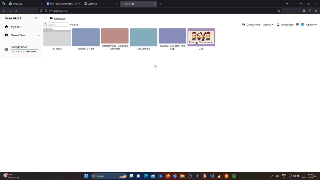

## React File Browser

### Setup

1. install the dependencies with `npm install`
2. run the server with `npm start`
3. server starts at `http://localhost:3000`

 

 
The indvidual components of the file browser could be found in the `src/components` folder. Each of the function is well documented using docstrings.

### Architecture

### Features

1. File Browser:

   1. File Navigation:
      Users can navigate through the files and folders.
   2. File Selection:
      Users can select files and folders.

      

2. File Upload:
   1. Upload File:
      Users can upload files to the server.
   2. Upload Multiple Files:
      Users can upload multiple files to the server.
3. File Download:
   1. Download File:
      Users can download files from the server, currently this can be done one at a time.
4. File Delete:
   1. Delete File:
      Users can delete files from the server, currently this can be done one at a time.
   2. Delete Multiple Files:
      Users can delete multiple files from the server.
5. File Sharing:
   1. Share File:
      Users can share files with other users by providing their user id.
   2. Share Folder:
      Users can share folders with other users by providing their user id.

       

   3. Manage Sharing:
      Users can manage the sharing of files and folders by other users.
   4. Public Sharing:
      Users can share files and folders publicly by generating a sharable paths.

       

6. File Search:
   1. Search By Name:
      Users can search files and folders by their name.
7. File Sorting:
   1. Name
   2. Size
   3. Last Modified
   4. Type
8. File Preview:
   Following viewers have been integrated:
   1. Image Viewer
   2. PDF Viewer
   3. Video Viewer
   4. Audio Viewer
   5. Text Viewer
   6. Markdown Viewer
